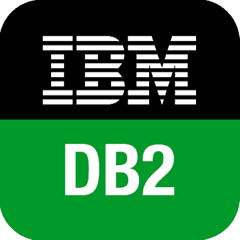

<h1 align="center">Welcome to my profile!</h1>
 

 
Hi I'm Sebastián

 
  

 
  I am sutudent of University Programmer Analyst and software developer. I'm a Software Developer with an experience in Development with HTML, CSS, Java Script, Git, Node.JS, MongoDB, React.JS, MySQL, Java, Cobol, JCL and DB2.

  
<h2 align="center"> Contact Me </h2>

  &nbsp; &nbsp; &nbsp; 
  &nbsp;&nbsp;&nbsp;&nbsp;

 

  <h2 align="center">Technologies</h2>

  &nbsp;
&nbsp; 
&nbsp;
&nbsp;
&nbsp;
&nbsp;
&nbsp;
&nbsp;
&nbsp;
&nbsp;

 

 

